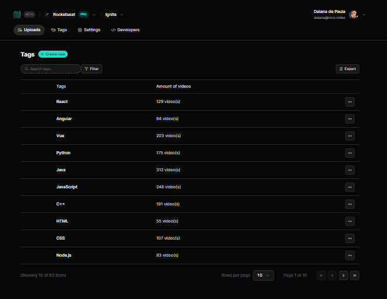

<br />
<div align="center">

<a href="https://listagem-de-dados.netlify.app/">
    
</a>

  

<h2 align="center">Listagem de dados</h2>

[Project Demo](https://listagem-de-dados.netlify.app/)

</div>


## About The Project

<p align="center">
  <a href="https://github.com/daianaadepaula/react-na-pratica-app">
    
  </a>
</p>

Here's a blank template to get started: To avoid retyping too much info. Do a search and replace with your text editor for the following: `daianaadepaula`, `react-na-pratica-app`, `daianadepaula`, `daianaadepaula1@gmail.com`, `listagem de dados`, `UI, filter and pagination`


### Built With

* React 
* Vue
* jQuery
* Tailwind CSS
* Radix
* Git
* Netlify


## Getting Started

This is an example of how you may give instructions on setting up your project locally.
To get a local copy up and running follow these simple example steps.

### Prerequisites

This is an example of how to list things you need to use the software and how to install them.
* npm
  ```sh
  npm install npm@latest -g
  ```
* node
  ```sh
  npm install node@latest -g
  ```


### Installation

1. Clone this repository
   ```sh
   git clone https://github.com/daianaadepaula/react-na-pratica-app.git
   ```
2. Go into the repository
   ```sh
   cd react-na-pratica-app
   ```
3. Install NPM packages
   ```sh
   npm install
   ```
4. Run the app
   ```sh
   npm run dev
   ```


## License

This project is licensed under the terms of the **MIT** license.

[](https://opensource.org/licenses/MIT)


## Contact

<div align="center">

Daiana de Paula - 
[LinkedIn](https://www.linkedin.com/in/daianadepaula/) - 
[Email](mailto:daianaadepaula1@gmail.com) - 
[GitHub](https://github.com/daianaadepaula)

</div>